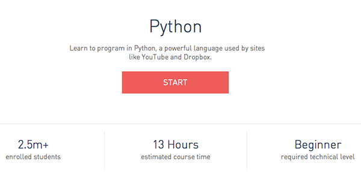

# HNRS 420 Spring 2015

## Computation and Society

**Meeting Time:  **&nbsp;&nbsp;Mondays, 2:00pm - 5:15pm

**Location:  **&nbsp;&nbsp;A Building, Room 108

**Professor:**&nbsp;&nbsp;Scott Frees, Associate Professor of Computer Science

** Contact Information** 
Office&nbsp;&nbsp;G315 
Phone&nbsp;&nbsp;(201) 684-7726 
Email&nbsp;&nbsp;[sfrees@ramapo.edu](mailto:sfrees@ramapo.edu)

## Course Description
The focus of this course is the exploration of how computers have, and continue to transform our society.  The course will begin with a historical, and hands-on study of how a computer and the software that drives it is created, including a topical treatment of programming to familiarize the student with computing.  The course will then focus on the major innovations that computing is enabling in our society, and how these impact economics, ethics, and law.  This will include topics such as hacking and identity/financial fraud, crypto currencies such as Bitcoin, data mining and privacy issues, and the effects of automation and computerization on economic and social imbalances.  This course does not assume any previous experience in computer programming.

## Pre-Requisites

College Honors Program Admission. 
Permission of Instructor required.

## Course Materials
Most of the reading required in this course will be material freely available on the web.  For each week, a listing of several (shortish) articles will be posted (see the individual lecture pages, accessible from the links in the 'Course Topics' section).

There are two books the class is **required to read**, which will be discussed in detail throughout the semester.  The first, [The Innovators](href='http://www.amazon.com/The-Innovators-Hackers-Geniuses-Revolution/dp/147670869X/ref=br_lf_m_239332_1_4_ttl?ie=UTF8&s=books&pf_rd_p=1953735202&pf_rd_s=center-2&pf_rd_t=1401&pf_rd_i=239332&pf_rd_m=ATVPDKIKX0DER&pf_rd_r=1GM630QHX1T0PM1CW3AB), will give you a glimpse into some of the most important people in the history of computing.  The second, [Who Owns the Future](http://www.amazon.com/exec/obidos/ASIN/1451654960/simonsayscom), presents a fairly opinionated discussion/idea about where technology and specifically computers are taking society.  These books will provide some common ground for the class to draw upon during debates and presenations.

&nbsp;&nbsp;
&nbsp;

Please note that pages/chapters have been assigned from each text and are listed in 'Reading' section within each of the lecture pages linked to below.  

## Course Topics
Most lectures will include student debate or presentations.  The schedule and assignments for these will be listed on the associated lecture's page, you can access
them by clicking on the topic below.  

*Note, each lecture page also lists the assigned readings and the course material (lecture slides, including those used by students).  **SO CLICK THE LINKS!!!***

|Lecture |Date |Topic |
|:---------|:------|:------|
| 1|  1/26/15 	| [A brief history of computing, and why need to care...](lect01.html) |
| 2|  2/2/15 	| [Why you need to know how to program](lect02.html) |
| 3|  2/9/15 	| [The open source culture](lect03.html) |
| 4|  2/16/15 	| [Security and Encryption, and why you shouldn't completely trust it.](lect04.html) |
| 5|  2/23/15	| [Buying and sharing your identity](lect05.html) |  
| 6|  3/2/15 	| [The NSA, spying, and cyberterrorism?](lect06.html) |  
| 7|  3/9/15 	| [Off-the-grid - networks and technology of anonymity](lect07.html) |  
| |   3/16/15 	| Spring Break - No Classes Held
| 8|  3/23/15 	| [Innovation:  The cult of silicon valley and the young](lect08.html) |  
| 9|  3/30/15 	| [Who are you getting your information from?](lect09.html) |  
| 10| 4/6/15	| [Disruption Case-Study Education](lect10.html) |
| 11| 4/13/15 	| [Net neutrality:  Who will control the internet](lect11.html) |
| 12| 4/20/15 	| [Emerging Technologies](lect12.html) |  
| 13| 4/27/15 	| [The fully automated society - what will we do? - Part 1](lect13.html) |
| 14| 5/4/15 	| [The fully automated society - what will we do? - Part 2](lect14.html) |

## Lecture Organization
The class meets from 2pm-5:15pm.  While there will be some variation week to week, you can expect that we will use the following rough schedule:  

The first 45-60 minutes, I will outline the topics that we are talking about for the week.  My "lecture" will be focused on (1) framing the topic, and (2) providing technical details behind the issue.  For example, when we talk about hacking in February, I will show you how security works (and doesn't work).  After I am done, we will have a short 10 minute break, and the students leading the week's debate will set up their presentation.  

For the next 60-90 minutes, we will discuss the topics from a variety of different directions - led by the team of students.  I will close the discussion with a summary.

The remaining 30 minutes of most lectures will be spent meeting with the group of students leading the *next weeks* discussion.  As a group, you will be expected to be nearly completely prepared for your debate at this time.  I will work with you to refine the presentation at this time to ensure we have a great session the following week.

On weeks 5, 6, and 12, parts or all of the lecture will be spent on student presentations of topics.  

There will be no in-class exams in this course.

## Course Assignments

### Presentations
Students will be grouped (by the instructor) into teams of 3 for two presentations to be made during the semester.  Presentations will be 15 minutes long, plus Q & A

#### Presentation 1 - Security Disasters (2/23/14 and 3/2/14)
The first presentation will be on a specific instance where security issues have had a significant effect on the public.   This can be related to identity/financial fraud, privacy infrigement (by hackers, companies, or the government), and infrastructure (cyberterrorism, bugs).  

#### Presentation 2 - Emerging Technologies (4/20/14)
The second presentation is focused on an emerging technology.  Here are the potential topics:

* Quantum Computing - what does this mean for computing power?
* Virtual Reality - is the Oculus Rift just the beginning?
* Autonomous Vehicles - From drones to self-driving cars - what will we be using in 5 years?
* 3D Printing - where is this going?
* High Frequence Trading - what is it, how is it effecting our economy, and what is its future?

### Debates
The second part of eight of the lectures include a semi-structured debate.  Students will be paired, and two teams (4 total students) will be expected to frame a debate surrounding the topic assigned.  

The purpose of the team is not only to debate each other, but to be "subject matter" experts and help frame the class's discussion.  Your grade will be based on (1) how well you understand the problem/topic, (2) how persuasively you make your arguments, and (3) how well you get the rest of the class involved in the discussion.

*8 debates, 16 team assignments.  7-8 teams, each team will have 2 debates.  Teams to be assigned first week of class*

### Essays
You will be required to write two essays, each corresponding to the two major themes of the course.  Your grade will be based on how compelling of a topic you choose and the level of research, accuracy, and logic applied to your discussion and conclusions.  

**Each essay is expected to be 5-7 pages, double spaced (1.25" margins, 12pt font)**.

#### Essay 1:  Seminal Events in Computing (due 3/9/14)
Select a particular event, or invention/software release that you feel has "changed the world".  Do a deep-dive into how that event came to pass - who were the major players, what were the enabling events?
#### Essay 2:  Industries effected by Computing (due 5/4/14)
You must select an industry profoundly changed by the automation and democratization of the computer age, and discuss this from a variety of perspectives.  How has it helped the consumer?  How has it helped the specific industry (the product)?  How has it effective the workforce?  Has this been a net-positive for society?

### Learning to code
The focus of this course is not to make you an expert in program, by any stretch.  However, there is a lot
to be learned by walking a mile in the shoes of a programmer.  The CEC component of this course will be the completion
of a beginners tutorial in Python programming.  Python is a very beginner-friendly language, but is used extensively
in both small and huge programming projects alike.

By 5/4/15, You are required to complete all lessons in [Code Academy's Python Course](http://www.codecademy.com/en/tracks/python).  

To verify you've completed the
exercises, you will be required to show me, at some point in the semester, your account page (which shows your progress).

## Grading

| % | Activity
|------------------:|:---------------
|30%|Your participation in during times where you are not leading the debate/presentation
|20%|Your effectiveness during debates (while leading the debate)
|20%|Your presentations
|20%|Your essays
|10%|Your coding assignment (codeacademy python).  This is the CEC
